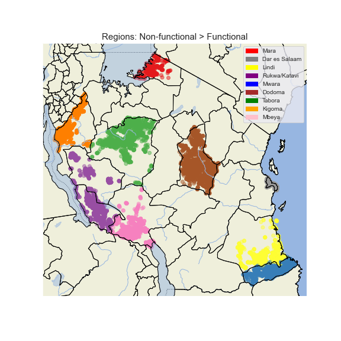
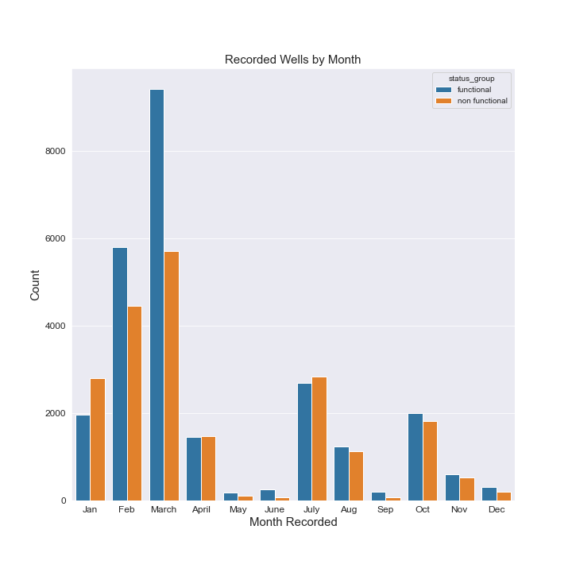

# Classifying Tanzania Wells Based on Functionality  

**Author:** Jack Mannix

## Summary 

A model trained to predict the functional status (‘Functional’ or ‘Non-functional’) of a well in Tanzania allows responsible entities to be notified when a well is in need of repair  

## Business Problem 

WaterTanzania, a nonprofit, wants to improve access to water across Tanzania. To do so, they want to be able to send alerts to the entities in charge of a well(s) to check the status its functional status. Ontop of sending alerts when a well is deemed 'non-functional,' WaterTanzania also wants to send precautionary alerts based on observed well characteristics in order to repair wells before they become 'Non-functional'. With this goal in mind, the nonprofit needs an algorithm that can accurately predict the status of a well, and  prioritize minimal false predictions for wells that are actually 'non-functioning'. 

## Data and Methods 

All models were trained and tested on data collected from 47,304 wells   
- Data provided by [TAARIFA](https://taarifa.org/) and [DrivenData](https://www.drivendata.org/competitions/7/pump-it-up-data-mining-the-water-table/page/23/)
- Data collected 2011 - 2013
- Models used
    1. Logistic Regression
    2. DecisionTree
    3. RandomForest
    4. SVM
    5. XGBoost
    
    
### Assumptions
The original data provided three target variables
1. Functional
2. Non-functional
3. Funcional-Needs Repair

Due to a major class imbalance against 'Functional-Needs Repair', preliminary models produced severly low recall for this variable

REPORT

To address this imbalance, 'Non-functional' and 'Functional-Needs Repair' were combined due to the following considerations:
    1. A well that is 'Functional-Needs Repair' is not fully functional, and will decline to 'Nonfunctional' if not addressed
    2. Additional issues of misclassification arise:
        - Wells that are 'Non-functinonal' that are classified as 'Functional-Needs Repair' would be less of a priority to fix 
        - Wells that are 'Functional-Needs Repair' that are classified as 'Functional' miss the chance for being repaired before becoming 'Non-functional' 
    3. Additional misclassifications cannot be risked when working with human rights such as access to clean water 
        
REPORT

---------------------------------------------------------------

# Process 

## Data Cleaning 

This dataset was mainly comprised of 30 object features, and only 9 features with continuous values 
- Object features had many unique values, causing extreme multidimensionality (>1,000 features) after one-hot-encoding 
- For object features not dropped, unique values with counts <1,000 were aggregated into an 'Other' value 

**Columns Dropped (17):**
- id
- scheme_name
- subvillage
- waterpoint_type_group
- quantity_group 
- water_quality 
- payment 
- funder
- installer
- date_recorded
- year_recorded
- source_type
- extraction_type
- recorded_by
- ward
- lga
- management

**Feature Engineering:**
- month_recorded
- well_age 

**Null Values:**
- 17,542 null values dropped
- 48,630 entries remain 

**Filler Data:**
- # Nonsensical 'longitude' - dropped
- '0' in object features combined into 'Other' 

**Outliers:**
- >1000 entries collected in 2002 and 2004 - dropped 

## EDA

No glaring concentrations of a particular well classification to discern from geographical data

- Regions with greater concentrations of "Non-functioning" wells than "Functioning"
    - Mara, Mtwara, Tabora, Rukwa, Mwanza, Kigoma, Lindi, Dodoma, Mbeya, Singida, Dar es Salaam 

  
   

  

- Wells over the age of 24 tended to have more "Non-functioning" wells than "Functioning"

 

- Nearly all wells with quantity = 'dry' are "Non-functioning' 
- Wells with quantity = 'insufficient' have high "Non-functioning' counts (while still lower than 'Functioning')

- January, April, and July experienced higher reports of "Non-functioning" than "Functioning" 

- Wells with quality_group = 'salty' have a higher 'Non-functioning' count than 'Functioning' 

 

## Modeling 

**Models Used (In Order):**
1. Logistic Regression 
2. DecisionTree
3. RandomForest
4. SVM
5. XGBoost (FINAL) 

### Final Model 
The final XGBoost model was achieved after three iterations of optimization via GridSearch

**Baseline:**

  
   

 

- This baseline was the first baseline to not completely overfit the training data

**Final Model:**

  
   

 

- Considering that False Negatives are much more harmful than False Positives, the difference between the two is acceptable
    - This model produced the lowest amount of False Negatives (859)
- Compared to the previous best model (RandomForest), recall and f1 scores have improved by 1%
    - the improvement of f1 scores along with recall indicates that the model is not completely sacrificing precision to achieve higher recall 

**Hyperparameters:**
1. sub_sample = 0.5
2. scale_pos_weight = 2
3. learning_rate = 0.2
4. max_depth = 8

---------------------------------------------------------------

# Going Forward

## Reccomendations 
With the predictive capabilities the model and the insight of the initial EDA, NONPROFIT should consider the following while implementing the use of the model: 

**Heightened Monitoring**
- Regions in which Non-functional wells outnumber functional should be monitored with heightened attention:
    - Mara
    - Mtwara
    - Tabora
    - Rukwa
    - Kigoma
    - Lindi
    - Dodoma
    - Mbeya
    - Dar es Salaam
- Monitoring efforts should increase during months in which Non-functional wells outnumber functional  
    - January, April, and July
    
**Alerts**
- Send alerts encouraging more frequent checks on wells age 25 and up 
- Send alerts when a well's water level (quantity) is reported as 'insufficient' or 'dry' 
- Send alerts when a well's water quality is reported as 'salty' 

## Further Investigation 

- Conduct PCA during initial data cleaning in order to reduce dimensionality in a more calculated manner
- 

---------------------------------------------------------------

# Further Information

For further information regarding the analysis, please view the [Jupyter Notebook](final_notebook.ipynb) or review the findings presentation [HERE](phase_3_presentation.pdf) 

